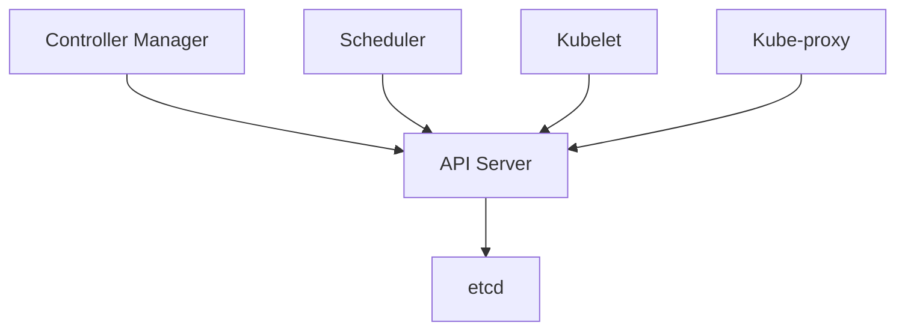

## 如何做k8s资源的规划

在K8s中进行资源规划是一个重要的任务，我来详细解释一下关键点：

### 1. CPU和内存资源规划

#### 1.1 资源请求(requests)和限制(limits)
```yaml:deployment.yaml
spec:
  containers:
  - name: app
    resources:
      requests:
        memory: "256Mi"
        cpu: "250m"
      limits:
        memory: "512Mi"
        cpu: "500m"
```

- **requests**: 容器需要的最小资源量
- **limits**: 容器能够使用的最大资源量
- CPU单位：1 CPU = 1000m（毫核）
- 内存单位：Mi（兆字节）, Gi（吉字节）

### 2. 命名空间资源配额

```yaml:quota.yaml
apiVersion: v1
kind: ResourceQuota
metadata:
  name: compute-quota
  namespace: your-namespace
spec:
  hard:
    requests.cpu: "4"
    requests.memory: 4Gi
    limits.cpu: "8"
    limits.memory: 8Gi
    pods: "10"
```

### 3. 资源规划的最佳实践

1. **监控历史数据**
   - 使用Prometheus + Grafana监控应用实际资源使用情况
   - 观察峰值和平均值
   - 留出30-50%的buffer以应对突发流量

2. **合理设置requests和limits**
   - requests设置为应用正常运行需要的资源量
   - limits设置为预期峰值的1.5-2倍
   - 避免limits设置过低导致OOM

3. **Pod水平自动扩缩容(HPA)**
```yaml:hpa.yaml
apiVersion: autoscaling/v2
kind: HorizontalPodAutoscaler
metadata:
  name: app-hpa
spec:
  scaleTargetRef:
    apiVersion: apps/v1
    kind: Deployment
    name: your-app
  minReplicas: 2
  maxReplicas: 10
  metrics:
  - type: Resource
    resource:
      name: cpu
      target:
        type: Utilization
        averageUtilization: 70
```

### 4. 节点资源规划

1. **节点标签和污点**
```yaml:node-label.yaml
kubectl label nodes node1 workload-type=cpu-intensive
kubectl taint nodes node1 dedicated=cpu-intensive:NoSchedule
```

2. **节点亲和性**
```yaml:pod-affinity.yaml
spec:
  affinity:
    nodeAffinity:
      requiredDuringSchedulingIgnoredDuringExecution:
        nodeSelectorTerms:
        - matchExpressions:
          - key: workload-type
            operator: In
            values:
            - cpu-intensive
```

### 5. 资源规划检查清单

1. **应用层面**
- [ ] 确定应用的基准资源需求
- [ ] 设置合适的requests和limits
- [ ] 配置HPA策略

2. **集群层面**
- [ ] 设置namespace资源配额
- [ ] 规划节点池和节点规格
- [ ] 配置节点亲和性策略

3. **监控和优化**
- [ ] 部署监控系统
- [ ] 定期检查资源使用情况
- [ ] 根据实际情况调整资源配置

### 6. 注意事项

1. **避免资源过度分配**
   - 合理评估应用资源需求
   - 定期清理未使用的资源

2. **考虑成本优化**
   - 使用spot实例降低成本
   - 配置集群自动扩缩容
   - 优化资源利用率

3. **确保高可用**
   - 合理设置Pod反亲和性
   - 跨可用区部署
   - 预留足够的资源buffer

通过以上方法进行资源规划，可以确保应用在K8s集群中稳定运行，同时实现资源的最优利用。记住要定期检查和调整资源配置，以适应业务的变化和增长。

## k8s的组件有哪些

**1、etcd 保存了整个集群的状态；**

**2、apiserver 提供了资源操作的唯一入口，并提供认证、授权、访问控制、API 注册和发现等机制；**

**3、controller manager 负责维护集群的状态，比如故障检测、自动扩展、滚动更新等；**

**4、scheduler 负责资源的调度，按照预定的调度策略将 Pod 调度到相应的机器上；**

**5、kubelet 负责维护容器的生命周期，同时也负责 Volume（CVI）和网络（CNI）的管理；**

**6、Container runtime 负责镜像管理以及 Pod 和容器的真正运行（CRI）；**

**7**、**kube-proxy** **负责为** **Service** **提供** **cluster** **内部的服务发现和负载均衡。**


让我详细介绍K8s的核心组件：

### 1. 控制平面组件（Master节点）

1. **API Server**
- 集群的统一入口
- 提供REST API接口
- 负责组件间的通信
- 认证和授权
```yaml
# API Server配置示例
apiVersion: v1
kind: Pod
metadata:
  name: kube-apiserver
  namespace: kube-system
spec:
  containers:
  - name: kube-apiserver
    image: k8s.gcr.io/kube-apiserver:v1.24.0
    command:
    - kube-apiserver
    - --advertise-address=192.168.1.10
    - --allow-privileged=true
    - --authorization-mode=Node,RBAC
```

2. **etcd**
- 分布式键值存储
- 保存集群所有数据
- 高可用配置
```yaml
# etcd配置示例
spec:
  containers:
  - name: etcd
    image: k8s.gcr.io/etcd:3.5.1
    command:
    - etcd
    - --advertise-client-urls=https://192.168.1.10:2379
    - --data-dir=/var/lib/etcd
```

3. **Controller Manager**
- 维护集群状态
- 故障检测和自动恢复
- 包含多个控制器：
  - Node Controller
  - Replication Controller
  - Endpoints Controller
  - Service Account & Token Controller

4. **Scheduler**
- 负责Pod调度
- 根据调度算法选择节点
- 考虑资源需求、亲和性等

### 2. 工作节点组件（Node节点）

1. **Kubelet**
- 节点代理
- 管理容器生命周期
- 执行Pod规范
```yaml
# Kubelet配置示例
kubelet:
  config:
    kind: KubeletConfiguration
    address: "0.0.0.0"
    port: 10250
    healthzPort: 10248
```

2. **Kube-proxy**
- 网络代理
- 维护网络规则
- 实现Service概念
```yaml
# Kube-proxy配置示例
apiVersion: kubeproxy.config.k8s.io/v1alpha1
kind: KubeProxyConfiguration
mode: "ipvs"  # 或者 "iptables"
```

3. **Container Runtime**
- 容器运行时
- 如Docker、containerd
- 负责容器的实际运行

### 3. 附加组件

1. **CoreDNS**
- 集群DNS服务
- 服务发现
```yaml
apiVersion: v1
kind: Service
metadata:
  name: kube-dns
  namespace: kube-system
spec:
  selector:
    k8s-app: kube-dns
  ports:
  - port: 53
    protocol: UDP
```

2. **Dashboard**
- Web UI界面
- 集群管理和监控

3. **CNI网络插件**
- 如Calico、Flannel
- 提供网络方案
```yaml
# Calico配置示例
kind: DaemonSet
metadata:
  name: calico-node
  namespace: kube-system
```

### 4. 组件间通信



### 5. 高可用配置建议

1. **控制平面**
- 至少3个master节点
- 使用负载均衡器
- etcd集群部署

2. **工作节点**
- 根据业务规模扩展
- 跨可用区部署
- 定期维护和更新

### 6. 监控要点

1. **核心指标**
- 组件健康状态
- API Server延迟
- etcd性能
- 调度器成功率

2. **告警配置**
```yaml
apiVersion: monitoring.coreos.com/v1
kind: PrometheusRule
metadata:
  name: k8s-components-alerts
spec:
  groups:
  - name: k8s-components
    rules:
    - alert: APIServerDown
      expr: up{job="apiserver"} == 0
```

这些组件共同工作，确保了Kubernetes集群的正常运行。了解每个组件的功能和配置对于运维和故障排查非常重要。

## scheduler和controller-manager的区别

让我详细解释Scheduler和Controller Manager的区别：

### 1. 基本职责

**Scheduler:**
- 负责Pod的调度决策
- 为Pod选择最合适的Node节点
- 不负责Pod的实际创建过程

**Controller Manager:**
- 负责维护集群状态
- 处理各类资源的控制循环
- 确保实际状态向期望状态迁移

### 2. 主要功能对比

1. **Scheduler功能:**
```yaml
# scheduler配置示例
apiVersion: kubescheduler.config.k8s.io/v1
kind: KubeSchedulerConfiguration
profiles:
- schedulerName: default-scheduler
  plugins:
    score:
      disabled:
      - name: NodeResourcesLeastAllocated
      enabled:
      - name: NodeResourcesMostAllocated
```

2. **Controller Manager功能:**
```yaml
# 包含多个控制器
- Deployment Controller
- ReplicaSet Controller
- StatefulSet Controller
- Node Controller
- Service Controller
- Endpoints Controller
- Namespace Controller
```

### 3. 工作流程

**Scheduler:**
1. 监听API Server中未被调度的Pod
2. 根据调度算法为Pod选择节点
3. 将调度结果更新到API Server

**Controller Manager:**
1. 监听API Server中资源变化
2. 对比实际状态和期望状态
3. 执行必要的操作使集群达到期望状态

### 4. 实际应用示例

1. **Scheduler处理Pod调度:**
```yaml
apiVersion: v1
kind: Pod
metadata:
  name: nginx
spec:
  containers:
  - name: nginx
    image: nginx
  # Scheduler会根据以下条件选择节点
  nodeSelector:
    disk: ssd
  affinity:
    nodeAffinity:
      requiredDuringSchedulingIgnoredDuringExecution:
        nodeSelectorTerms:
        - matchExpressions:
          - key: kubernetes.io/e2e-az-name
            operator: In
            values:
            - e2e-az1
            - e2e-az2
```

2. **Controller Manager处理Deployment:**
```yaml
apiVersion: apps/v1
kind: Deployment
metadata:
  name: nginx-deployment
spec:
  replicas: 3  # Controller确保运行3个副本
  selector:
    matchLabels:
      app: nginx
  template:
    metadata:
      labels:
        app: nginx
    spec:
      containers:
      - name: nginx
        image: nginx:1.14.2
```

### 5. 主要区别总结

1. **职责范围:**
   - Scheduler: 仅负责Pod调度
   - Controller Manager: 负责整个集群状态维护

2. **工作方式:**
   - Scheduler: 一次性决策（为Pod选择节点）
   - Controller Manager: 持续循环（reconcile循环）

3. **关注点:**
   - Scheduler: 资源分配和约束条件
   - Controller Manager: 状态维护和自动修复

4. **操作对象:**
   - Scheduler: 主要处理Pod
   - Controller Manager: 处理所有Kubernetes资源

### 6. 使用建议

1. **Scheduler相关:**
   - 合理配置资源请求和限制
   - 使用节点亲和性和反亲和性
   - 配置合适的调度策略

2. **Controller Manager相关:**
   - 正确设置资源的期望状态
   - 监控控制器的运行状态
   - 了解不同控制器的作用

通过理解这些区别，可以更好地：
1. 规划应用部署策略

2. 解决调度问题

3. 处理集群状态异常

4. 优化资源使用效率

   

## ingress和service的区别

让我详细解释Ingress和Service的区别：

### 1. 基本定义

**Service:**
```yaml
apiVersion: v1
kind: Service
metadata:
  name: my-service
spec:
  selector:
    app: my-app
  ports:
  - port: 80
    targetPort: 8080
  type: ClusterIP  # 或 NodePort, LoadBalancer
```

**Ingress:**
```yaml
apiVersion: networking.k8s.io/v1
kind: Ingress
metadata:
  name: my-ingress
spec:
  rules:
  - host: myapp.example.com
    http:
      paths:
      - path: /api
        pathType: Prefix
        backend:
          service:
            name: my-service
            port:
              number: 80
```

### 2. 主要区别

1. **功能定位**
   - Service: 提供集群内部的服务发现和负载均衡
   - Ingress: 提供集群外部访问的HTTP/HTTPS路由规则

2. **协议支持**
   - Service: 支持任何TCP/UDP协议
   - Ingress: 主要支持HTTP/HTTPS协议

3. **访问层级**
   - Service: 网络层(L4)
   - Ingress: 应用层(L7)

### 3. 常见使用场景

1. **Service使用场景:**
```yaml
# 内部服务访问
apiVersion: v1
kind: Service
metadata:
  name: db-service
spec:
  selector:
    app: mysql
  ports:
  - port: 3306
    targetPort: 3306
  type: ClusterIP
```

2. **Ingress使用场景:**
```yaml
# 外部访问路由
apiVersion: networking.k8s.io/v1
kind: Ingress
metadata:
  name: web-ingress
  annotations:
    nginx.ingress.kubernetes.io/rewrite-target: /
spec:
  rules:
  - host: www.myapp.com
    http:
      paths:
      - path: /api
        pathType: Prefix
        backend:
          service:
            name: api-service
            port:
              number: 80
      - path: /web
        pathType: Prefix
        backend:
          service:
            name: web-service
            port:
              number: 80
```

### 4. 高级特性对比

1. **Service特性:**
```yaml
apiVersion: v1
kind: Service
metadata:
  name: my-service
spec:
  type: LoadBalancer
  sessionAffinity: ClientIP
  sessionAffinityConfig:
    clientIP:
      timeoutSeconds: 10800
  ports:
  - port: 80
```

2. **Ingress特性:**
```yaml
apiVersion: networking.k8s.io/v1
kind: Ingress
metadata:
  annotations:
    nginx.ingress.kubernetes.io/ssl-redirect: "true"
    nginx.ingress.kubernetes.io/force-ssl-redirect: "true"
spec:
  tls:
  - hosts:
    - myapp.com
    secretName: tls-secret
```

### 5. 最佳实践

1. **组合使用示例:**
```yaml
# Service配置
apiVersion: v1
kind: Service
metadata:
  name: web-service
spec:
  selector:
    app: web
  ports:
  - port: 80
    targetPort: 8080
---
# Ingress配置
apiVersion: networking.k8s.io/v1
kind: Ingress
metadata:
  name: web-ingress
spec:
  rules:
  - host: web.example.com
    http:
      paths:
      - path: /
        pathType: Prefix
        backend:
          service:
            name: web-service
            port:
              number: 80
```

### 6. 使用建议

1. **何时使用Service:**
   - 集群内部服务访问
   - 需要TCP/UDP协议支持
   - 简单的负载均衡需求

2. **何时使用Ingress:**
   - 需要域名访问
   - 需要路径匹配
   - 需要SSL/TLS终止
   - 需要URL重写
   - 需要应用层负载均衡

通过合理组合使用Service和Ingress，可以构建完整的服务访问体系。


## 打污点的命令

让我介绍一下打污点(Taint)的相关命令：

### 1. 基本命令格式

```bash
# 添加污点
kubectl taint nodes <node-name> <key>=<value>:<effect>

# 删除污点
kubectl taint nodes <node-name> <key>-
```

### 2. 常用污点效果(effect)

- **NoSchedule**: 不允许调度
- **PreferNoSchedule**: 尽量不调度
- **NoExecute**: 不允许调度，并驱逐已有Pod

### 3. 常用命令示例

```bash
# 添加不可调度污点
kubectl taint nodes node1 key1=value1:NoSchedule

# 添加优先不调度污点
kubectl taint nodes node2 key2=value2:PreferNoSchedule

# 添加驱逐污点
kubectl taint nodes node3 key3=value3:NoExecute

# 删除指定污点
kubectl taint nodes node1 key1-

# 删除所有污点
kubectl taint nodes node1 key1- key2- key3-
```

### 4. 实际应用场景

```bash
# 标记专用节点（如GPU节点）
kubectl taint nodes gpu-node-1 dedicated=gpu:NoSchedule

# 标记故障节点
kubectl taint nodes problem-node-1 node-problem=true:NoExecute

# 标记master节点
kubectl taint nodes master-node node-role.kubernetes.io/master=:NoSchedule
```

### 5. 查看节点污点

```bash
# 查看节点详情（包含污点信息）
kubectl describe node <node-name>

# 使用自定义输出格式查看污点
kubectl get nodes -o custom-columns=NAME:.metadata.name,TAINTS:.spec.taints
```

记住：
1. 添加污点后需要配合容忍度(Toleration)使用
2. 谨慎使用NoExecute效果
3. 操作前先确认对现有Pod的影响


## daemonset和deployment的区别

让我详细解释DaemonSet和Deployment的主要区别：

### 1. 基本定义和用途

**Deployment:**
```yaml
apiVersion: apps/v1
kind: Deployment
metadata:
  name: nginx-deployment
spec:
  replicas: 3
  selector:
    matchLabels:
      app: nginx
  template:
    metadata:
      labels:
        app: nginx
    spec:
      containers:
      - name: nginx
        image: nginx:1.14.2
```

**DaemonSet:**
```yaml
apiVersion: apps/v1
kind: DaemonSet
metadata:
  name: fluentd-ds
spec:
  selector:
    matchLabels:
      app: fluentd
  template:
    metadata:
      labels:
        app: fluentd
    spec:
      containers:
      - name: fluentd
        image: fluentd:v1.14
```

### 2. 主要区别

1. **部署策略**
   - Deployment: 根据replicas数量部署指定数量的Pod
   - DaemonSet: 在每个节点上运行一个Pod副本

2. **使用场景**
   - Deployment:
     - 无状态应用
     - 需要指定副本数的应用
     - 支持滚动更新
   
   - DaemonSet:
     - 日志收集(如fluentd)
     - 节点监控(如node-exporter)
     - 网络插件(如calico)

3. **扩缩容**
   - Deployment: 可以手动或自动调整replicas数量
   - DaemonSet: 随节点数量自动增减，不支持手动扩缩容

### 3. 典型应用场景

**Deployment示例（应用服务）:**
```yaml
apiVersion: apps/v1
kind: Deployment
metadata:
  name: web-app
spec:
  replicas: 3
  selector:
    matchLabels:
      app: web
  template:
    metadata:
      labels:
        app: web
    spec:
      containers:
      - name: web
        image: nginx:1.14.2
        ports:
        - containerPort: 80
```

**DaemonSet示例（监控代理）:**
```yaml
apiVersion: apps/v1
kind: DaemonSet
metadata:
  name: node-exporter
spec:
  selector:
    matchLabels:
      app: node-exporter
  template:
    metadata:
      labels:
        app: node-exporter
    spec:
      containers:
      - name: node-exporter
        image: prom/node-exporter
        ports:
        - containerPort: 9100
```

### 4. 更新策略

1. **Deployment更新策略:**
```yaml
spec:
  strategy:
    type: RollingUpdate
    rollingUpdate:
      maxSurge: 25%
      maxUnavailable: 25%
```

2. **DaemonSet更新策略:**
```yaml
spec:
  updateStrategy:
    type: RollingUpdate
    rollingUpdate:
      maxUnavailable: 1
```

### 5. 使用建议

1. **选择Deployment场景:**
   - 常规的Web应用
   - 微服务应用
   - 需要负载均衡的服务

2. **选择DaemonSet场景:**
   - 系统级服务
   - 监控采集服务
   - 日志收集服务
   - 存储插件

### 6. 注意事项

1. **Deployment:**
   - 注意设置合适的资源请求和限制
   - 配置合理的健康检查
   - 考虑配置HPA实现自动扩缩容

2. **DaemonSet:**
   - 注意资源占用，因为会在每个节点运行
   - 合理配置污点容忍
   - 避免运行太多DaemonSet影响业务Pod

通过合理选择Deployment和DaemonSet，可以更好地满足不同的应用部署需求。


我看到您已经理解了Deployment和DaemonSet的区别。让我结合您的项目文件，给出一些具体建议：

### 1. 订单服务应该使用Deployment

```yaml
apiVersion: apps/v1
kind: Deployment
metadata:
  name: order-service
  namespace: core-business
spec:
  replicas: 3
  selector:
    matchLabels:
      app: order-service
  template:
    metadata:
      labels:
        app: order-service
    spec:
      containers:
      - name: order-service
        image: your-registry/order-service:latest
        ports:
        - containerPort: 8080
        resources:
          requests:
            memory: "1Gi"
            cpu: "500m"
          limits:
            memory: "2Gi"
            cpu: "1000m"
        readinessProbe:
          httpGet:
            path: /actuator/health
            port: 8080
          initialDelaySeconds: 30
          periodSeconds: 10
```

### 2. 配套的监控采集使用DaemonSet

```yaml
apiVersion: apps/v1
kind: DaemonSet
metadata:
  name: metrics-collector
  namespace: monitoring
spec:
  selector:
    matchLabels:
      app: metrics-collector
  template:
    metadata:
      labels:
        app: metrics-collector
    spec:
      containers:
      - name: collector
        image: your-registry/metrics-collector:latest
        resources:
          requests:
            memory: "256Mi"
            cpu: "100m"
          limits:
            memory: "512Mi"
            cpu: "200m"
        volumeMounts:
        - name: varlog
          mountPath: /var/log
      volumes:
      - name: varlog
        hostPath:
          path: /var/log
```

这样的组合可以确保：
1. 订单服务能够灵活扩缩容
2. 监控数据能够从每个节点收集
3. 符合您在quota.yaml中设置的资源限制


## k8s版本用的哪个版本

1.23.6

## scheduler调度的方式有哪些

让我详细介绍K8s的调度机制：

### 1. 调度过程

调度过程分为两个主要阶段：
1. **Predicates（预选）**：过滤不符合条件的节点
2. **Priorities（优选）**：对符合条件的节点进行打分

### 2. 常用调度方式

1. **节点选择器(NodeSelector)**
```yaml
apiVersion: v1
kind: Pod
metadata:
  name: nginx
spec:
  nodeSelector:
    disk: ssd
    gpu: "true"
```

2. **节点亲和性(Node Affinity)**
```yaml
spec:
  affinity:
    nodeAffinity:
      requiredDuringSchedulingIgnoredDuringExecution:
        nodeSelectorTerms:
        - matchExpressions:
          - key: kubernetes.io/e2e-az-name
            operator: In
            values:
            - e2e-az1
            - e2e-az2
```

3. **Pod亲和性(Pod Affinity)**
```yaml
spec:
  affinity:
    podAffinity:
      requiredDuringSchedulingIgnoredDuringExecution:
      - labelSelector:
          matchExpressions:
          - key: app
            operator: In
            values:
            - web
        topologyKey: kubernetes.io/hostname
```

4. **污点和容忍(Taints and Tolerations)**
```yaml
# 给节点添加污点
kubectl taint nodes node1 key=value:NoSchedule

# Pod配置容忍
spec:
  tolerations:
  - key: "key"
    operator: "Equal"
    value: "value"
    effect: "NoSchedule"
```

### 3. 高级调度特性

1. **Pod优先级和抢占**
```yaml
apiVersion: scheduling.k8s.io/v1
kind: PriorityClass
metadata:
  name: high-priority
value: 1000000
---
apiVersion: v1
kind: Pod
metadata:
  name: nginx
spec:
  priorityClassName: high-priority
```

2. **DaemonSet调度**
```yaml
apiVersion: apps/v1
kind: DaemonSet
metadata:
  name: fluentd-elasticsearch
spec:
  selector:
    matchLabels:
      name: fluentd-elasticsearch
  template:
    spec:
      tolerations:
      - key: node-role.kubernetes.io/master
        effect: NoSchedule
```

3. **自定义调度器**
```yaml
apiVersion: v1
kind: Pod
metadata:
  name: custom-scheduler-pod
spec:
  schedulerName: my-custom-scheduler
```

### 4. 资源限制调度

1. **资源请求和限制**
```yaml
spec:
  containers:
  - name: app
    resources:
      requests:
        memory: "64Mi"
        cpu: "250m"
      limits:
        memory: "128Mi"
        cpu: "500m"
```

2. **Pod拓扑分布约束**
```yaml
spec:
  topologySpreadConstraints:
  - maxSkew: 1
    topologyKey: zone
    whenUnsatisfiable: DoNotSchedule
    labelSelector:
      matchLabels:
        app: web
```

### 5. 最佳实践

1. **合理使用亲和性和反亲和性**
```yaml
spec:
  affinity:
    podAntiAffinity:
      preferredDuringSchedulingIgnoredDuringExecution:
      - weight: 100
        podAffinityTerm:
          labelSelector:
            matchExpressions:
            - key: app
              operator: In
              values:
              - web
          topologyKey: kubernetes.io/hostname
```

2. **设置默认的调度策略**
```yaml
apiVersion: kubescheduler.config.k8s.io/v1
kind: KubeSchedulerConfiguration
profiles:
- schedulerName: default-scheduler
  plugins:
    score:
      disabled:
      - name: NodeResourcesLeastAllocated
      enabled:
      - name: NodeResourcesMostAllocated
```

### 6. 注意事项

1. 避免过度使用硬性调度约束
2. 合理设置Pod优先级
3. 注意节点资源均衡
4. 考虑跨可用区调度
5. 定期检查调度失败的原因

通过合理使用这些调度机制，可以：
- 确保应用高可用
- 优化资源使用
- 满足特定的部署需求
- 提高集群的稳定性


我看到您已经理解了K8s的调度机制。让我结合实际场景，给出一些具体的调度策略建议：

### 1. 针对订单服务(OrderService)的调度策略

```yaml
apiVersion: apps/v1
kind: Deployment
metadata:
  name: order-service
spec:
  replicas: 3
  template:
    spec:
      # 优先级设置
      priorityClassName: high-priority
      
      # 亲和性设置
      affinity:
        # 节点亲和性 - 选择高性能节点
        nodeAffinity:
          requiredDuringSchedulingIgnoredDuringExecution:
            nodeSelectorTerms:
            - matchExpressions:
              - key: node-type
                operator: In
                values:
                - high-performance
        
        # Pod反亲和性 - 保证高可用
        podAntiAffinity:
          requiredDuringSchedulingIgnoredDuringExecution:
          - labelSelector:
              matchLabels:
                app: order-service
            topologyKey: kubernetes.io/hostname
      
      # 资源请求和限制
      containers:
      - name: order-service
        resources:
          requests:
            cpu: "2"
            memory: "4Gi"
          limits:
            cpu: "4"
            memory: "8Gi"
```

### 2. 配合资源配额(quota.yaml)的调度策略

```yaml
# 为订单服务创建专属命名空间配额
apiVersion: v1
kind: ResourceQuota
metadata:
  name: order-service-quota
  namespace: order-service
spec:
  hard:
    requests.cpu: "8"
    requests.memory: 16Gi
    limits.cpu: "16"
    limits.memory: 32Gi
    pods: "5"
```

### 3. 调度策略建议

1. **高可用保证**
   - 跨节点部署
   - 跨可用区部署
   - 资源预留

2. **性能保证**
   - 使用专用节点池
   - 合理的资源限制
   - 优先级设置

3. **弹性伸缩**
   - 配置HPA
   - 设置合理的扩缩容阈值
   - 资源预留空间

这样的配置可以确保订单服务的稳定性和性能。


## 集群层面的规划 根据业务规模 预估多少台机器 

让我为您详细说明集群规模的规划方法：

### 1. 业务规模评估

1. **业务指标评估**
   - 日活用户数（DAU）
   - 峰值QPS
   - 数据存储需求
   - 计算密集型/IO密集型

2. **单个服务资源需求**
```yaml
典型服务资源配置示例：
- 小型服务：
  CPU: 0.5-1核
  内存: 1-2Gi
  
- 中型服务：
  CPU: 2-4核
  内存: 4-8Gi
  
- 大型服务：
  CPU: 8核+
  内存: 16Gi+
```

### 2. 节点规格选择

1. **常用节点规格**
```
- 通用型：
  4核8G, 8核16G, 16核32G
  
- 计算密集型：
  16核32G, 32核64G
  
- 内存密集型：
  16核64G, 32核128G
```

2. **节点数量计算公式**
```
所需节点数 = (服务数量 × 单服务资源 × 副本数 × (1 + 冗余系数)) / 节点规格
```

### 3. 集群规模示例

1. **小型集群（适合初创公司）**
```
- 业务规模：
  DAU: 1-10万
  服务数量: 10-20个
  
- 节点配置：
  管理节点: 3台 4核8G
  工作节点: 3-5台 8核16G
  
- 总资源：
  CPU: 40-60核
  内存: 80-120G
```

2. **中型集群（适合中型企业）**
```
- 业务规模：
  DAU: 10-100万
  服务数量: 20-50个
  
- 节点配置：
  管理节点: 3台 8核16G
  工作节点: 10-20台 16核32G
  
- 总资源：
  CPU: 200-400核
  内存: 400-800G
```

3. **大型集群（适合大型企业）**
```
- 业务规模：
  DAU: 100万+
  服务数量: 50+个
  
- 节点配置：
  管理节点: 5台 16核32G
  工作节点: 50+台 32核64G
  
- 总资源：
  CPU: 1600+核
  内存: 3200+G
```

### 4. 规划注意事项

1. **资源预留**
```yaml
系统组件资源预留：
- kubelet: 0.1核/节点
- kube-proxy: 0.1核/节点
- 监控组件: 0.5-1核/节点
- 日志组件: 0.5-1核/节点

建议预留比例：
- CPU: 总量的20-30%
- 内存: 总量的30-40%
```

2. **扩展性考虑**
- 预留50%的增长空间
- 配置集群自动扩缩容
- 考虑多可用区部署

3. **成本优化**
```yaml
混合部署策略：
- 关键业务：使用按量付费节点
- 非关键业务：使用spot节点
- 固定负载：使用预留实例
```

### 5. 监控指标

需要持续监控以下指标来调整规划：
```
- 节点资源使用率
- Pod调度成功率
- 服务响应时间
- 容器重启次数
- 存储使用情况
```

建议：
1. 从小规模开始，根据实际运行情况逐步扩展
2. 使用节点池管理不同规格的节点
3. 合理使用资源配额限制namespace资源使用
4. 定期评估集群使用情况，及时优化资源分配


## 亲和性和非亲和性？

让我详细解释亲和性(Affinity)和非亲和性(Anti-affinity)：

### 1. 节点亲和性(Node Affinity)

```yaml
apiVersion: apps/v1
kind: Deployment
metadata:
  name: order-service    # 基于您的OrderService.java
spec:
  template:
    spec:
      affinity:
        nodeAffinity:
          # 硬性要求
          requiredDuringSchedulingIgnoredDuringExecution:
            nodeSelectorTerms:
            - matchExpressions:
              - key: zone
                operator: In
                values:
                - zone-a
                - zone-b
          # 软性要求
          preferredDuringSchedulingIgnoredDuringExecution:
          - weight: 100
            preference:
              matchExpressions:
              - key: node-type
                operator: In
                values:
                - high-performance
```

让我详细解释这段配置的含义：

```yaml
affinity:
  nodeAffinity:  # 节点亲和性配置
    # 1. 硬性要求 - 必须满足这些条件，否则Pod不会被调度到该节点
    requiredDuringSchedulingIgnoredDuringExecution:
      nodeSelectorTerms:
      - matchExpressions:
        - key: zone           # 节点标签的key
          operator: In        # 操作符：In表示值必须在列表中
          values:            # 可接受的值列表
          - zone-a           # 可以调度到zone-a的节点
          - zone-b           # 可以调度到zone-b的节点

    # 2. 软性要求 - 优先考虑满足这些条件的节点，但不是必须的
    preferredDuringSchedulingIgnoredDuringExecution:
    - weight: 100            # 权重：0-100之间，影响优先级计算
      preference:
        matchExpressions:
        - key: node-type     # 节点标签的key
          operator: In       # 操作符
          values:
          - high-performance # 优先选择标记为high-performance的节点
```

这个配置的作用是：

1. **硬性要求**：
   - Pod必须调度到带有`zone`标签的节点
   - 该标签的值必须是`zone-a`或`zone-b`
   - 如果找不到满足条件的节点，Pod将无法调度

2. **软性要求**：
   - 优先选择带有`node-type=high-performance`标签的节点
   - 权重100表示这是一个很强的偏好
   - 如果没有满足条件的节点，Pod也可以调度到其他节点

实际使用示例：
```bash
# 给节点打标签
kubectl label nodes node1 zone=zone-a
kubectl label nodes node2 zone=zone-b
kubectl label nodes node1 node-type=high-performance
```

这样的配置适合：
1. 跨可用区部署（zone-a, zone-b）
2. 对性能有要求的服务（high-performance）
3. 确保服务高可用性

### 2. Pod亲和性(Pod Affinity)

```yaml
apiVersion: apps/v1
kind: Deployment
metadata:
  name: order-service
spec:
  template:
    spec:
      affinity:
        podAffinity:
          # 要求和缓存服务部署在同一节点
          requiredDuringSchedulingIgnoredDuringExecution:
          - labelSelector:
              matchExpressions:
              - key: app
                operator: In
                values:
                - cache-service
            topologyKey: kubernetes.io/hostname
```

让我详细解释这段Pod亲和性配置：

```yaml
affinity:
  podAffinity:  # Pod亲和性配置
    requiredDuringSchedulingIgnoredDuringExecution:  # 硬性要求
    - labelSelector:        # 选择目标Pod的标签选择器
        matchExpressions:   # 标签匹配表达式
        - key: app         # 标签的key
          operator: In     # 操作符
          values:
          - cache-service  # 目标Pod的标签值
      topologyKey: kubernetes.io/hostname  # 拓扑域，这里表示同一个主机
```

这个配置的含义是：

1. **Pod亲和性要求**：
   - 当前的order-service必须和带有`app=cache-service`标签的Pod部署在同一个节点上
   - `kubernetes.io/hostname`表示"同一个主机"的范围

2. **实际应用场景**：
```yaml
# cache-service部署
apiVersion: apps/v1
kind: Deployment
metadata:
  name: cache-service
spec:
  template:
    metadata:
      labels:
        app: cache-service    # 缓存服务的标签
```

这种配置适用于：
1. 需要低延迟访问的场景（订单服务需要快速访问缓存）
2. 减少网络开销
3. 提高访问效率

实际效果：
- 如果某个节点上运行着cache-service
- order-service的Pod会被调度到相同的节点上
- 如果找不到运行cache-service的节点，order-service将无法被调度

这对于OrderService.java来说很有用，因为：
1. 订单服务经常需要访问缓存
2. 同节点部署可以降低延迟
3. 提高订单处理性能

### 3. Pod反亲和性(Pod Anti-affinity)

```yaml
apiVersion: apps/v1
kind: Deployment
metadata:
  name: order-service
spec:
  template:
    spec:
      affinity:
        podAntiAffinity:
          # 要求order-service的多个副本分散在不同节点
          requiredDuringSchedulingIgnoredDuringExecution:
          - labelSelector:
              matchLabels:
                app: order-service
            topologyKey: kubernetes.io/hostname
```

让我详细解释这段Pod反亲和性(Anti-affinity)配置：

```yaml
affinity:
  podAntiAffinity:  # Pod反亲和性配置
    requiredDuringSchedulingIgnoredDuringExecution:  # 硬性要求
    - labelSelector:    # 选择目标Pod的标签
        matchLabels:    
          app: order-service  # 匹配自己的服务标签
      topologyKey: kubernetes.io/hostname  # 拓扑域为主机级别
```

这个配置的含义是：
1. **反亲和性要求**：
   - 带有`app=order-service`标签的Pod必须分散在不同的节点上
   - 不允许两个order-service的Pod运行在同一个节点上

2. **实际效果**：
```yaml
# 如果部署3个副本
spec:
  replicas: 3  # 这三个Pod会被分散到不同节点
  template:
    metadata:
      labels:
        app: order-service  # 这个标签被用于反亲和性判断
```

这种配置的好处：
1. **提高可用性**：
   - 如果一个节点故障，只会影响一个Pod
   - 其他节点上的Pod继续提供服务

2. **负载均衡**：
   - Pod分散在不同节点上
   - 避免单个节点负载过高

3. **故障隔离**：
   - 硬件故障的影响被限制在单个副本
   - 提高整体服务稳定性

这对于OrderService.java特别有用，因为：
1. 订单服务是核心业务
2. 需要保证高可用性
3. 符合quota.yaml中的资源分配策略

### 4. 常见使用场景

1. **高可用部署:**
```yaml
apiVersion: apps/v1
kind: Deployment
metadata:
  name: order-service
spec:
  replicas: 3
  template:
    spec:
      affinity:
        podAntiAffinity:
          requiredDuringSchedulingIgnoredDuringExecution:
          - labelSelector:
              matchLabels:
                app: order-service
            topologyKey: kubernetes.io/hostname
        nodeAffinity:
          requiredDuringSchedulingIgnoredDuringExecution:
            nodeSelectorTerms:
            - matchExpressions:
              - key: node-type
                operator: In
                values:
                - production
```

让我详细解释这段配置，它结合了Pod反亲和性和节点亲和性：

```yaml
spec:
  replicas: 3   # 部署3个副本
  template:
    spec:
      affinity:
        # 1. Pod反亲和性配置
        podAntiAffinity:
          requiredDuringSchedulingIgnoredDuringExecution:
          - labelSelector:
              matchLabels:
                app: order-service    # 匹配订单服务的标签
            topologyKey: kubernetes.io/hostname    # 按主机级别分散

        # 2. 节点亲和性配置
        nodeAffinity:
          requiredDuringSchedulingIgnoredDuringExecution:
            nodeSelectorTerms:
            - matchExpressions:
              - key: node-type     # 节点标签
                operator: In       # 操作符
                values:
                - production      # 只部署在生产环境节点上
```

这个配置实现了两个目标：

1. **Pod反亲和性要求**：
   - 3个order-service副本必须运行在不同的节点上
   - 提高可用性，避免单点故障

2. **节点亲和性要求**：
   - 只能部署在带有`node-type=production`标签的节点上
   - 确保订单服务运行在生产环境节点上

实际使用示例：
```bash
# 标记生产环境节点
kubectl label nodes node1 node-type=production
kubectl label nodes node2 node-type=production
kubectl label nodes node3 node-type=production
```

这种配置特别适合OrderService.java这样的核心业务服务，因为它：
1. 确保高可用性（Pod分散部署）
2. 保证服务质量（只使用生产级别节点）
3. 符合quota.yaml中的资源规划


2. **性能优化:**

```yaml
apiVersion: apps/v1
kind: Deployment
metadata:
  name: order-service
spec:
  template:
    spec:
      affinity:
        nodeAffinity:
          preferredDuringSchedulingIgnoredDuringExecution:
          - weight: 100
            preference:
              matchExpressions:
              - key: cpu-type
                operator: In
                values:
                - high-performance
        podAffinity:
          preferredDuringSchedulingIgnoredDuringExecution:
          - weight: 100
            podAffinityTerm:
              labelSelector:
                matchLabels:
                  app: cache-service
              topologyKey: kubernetes.io/hostname
```

让我详细解释这段配置，它包含了节点亲和性和Pod亲和性的软性要求：

```yaml
affinity:
  # 1. 节点亲和性（软性要求）
  nodeAffinity:
    preferredDuringSchedulingIgnoredDuringExecution:  # 软性偏好
    - weight: 100    # 权重值，最高优先级
      preference:
        matchExpressions:
        - key: cpu-type
          operator: In
          values:
          - high-performance    # 优先选择高性能CPU的节点

  # 2. Pod亲和性（软性要求）
  podAffinity:
    preferredDuringSchedulingIgnoredDuringExecution:  # 软性偏好
    - weight: 100    # 权重值，最高优先级
      podAffinityTerm:
        labelSelector:
          matchLabels:
            app: cache-service    # 优先和缓存服务部署在一起
        topologyKey: kubernetes.io/hostname    # 同一节点
```


这个配置的特点：

1. **软性节点亲和性**：
   - 优先选择有`cpu-type=high-performance`标签的节点
   - 如果没有这样的节点，也可以调度到其他节点
   - weight: 100表示这是最高优先级的偏好

2. **软性Pod亲和性**：
   - 优先和cache-service部署在同一个节点
   - 如果无法满足，也可以部署在其他节点
   - weight: 100表示这是最高优先级的偏好

这种配置特别适合OrderService.java，因为：
1. 订单服务需要高性能CPU支持
2. 与缓存服务部署在一起可以减少网络延迟
3. 使用软性要求保证服务可以正常部署

实际效果：
```bash
# 标记高性能节点
kubectl label nodes node1 cpu-type=high-performance

# 部署缓存服务
kubectl apply -f cache-service.yaml

# order-service会优先考虑：
# 1. 有高性能CPU的节点
# 2. 已经运行着cache-service的节点
```


这种软性要求比之前的硬性要求更灵活，因为：
1. 不会因为条件不满足而阻止Pod调度
2. 在资源紧张时仍然可以部署
3. 符合quota.yaml中的资源规划策略

### 5. 最佳实践

1. **跨可用区部署:**
```yaml
apiVersion: apps/v1
kind: Deployment
metadata:
  name: order-service
spec:
  replicas: 3
  template:
    spec:
      affinity:
        podAntiAffinity:
          requiredDuringSchedulingIgnoredDuringExecution:
          - labelSelector:
              matchLabels:
                app: order-service
            topologyKey: topology.kubernetes.io/zone
```

让我详细解释这段配置，这是一个跨可用区(zone)的Pod反亲和性配置：

```yaml
spec:
  replicas: 3   # 部署3个副本
  template:
    spec:
      affinity:
        podAntiAffinity:    # Pod反亲和性
          requiredDuringSchedulingIgnoredDuringExecution:  # 硬性要求
          - labelSelector:
              matchLabels:
                app: order-service    # 匹配订单服务的标签
            topologyKey: topology.kubernetes.io/zone    # 按可用区分散
```


这个配置的含义是：
1. **跨可用区部署**：
   - 3个order-service的副本必须分布在不同的可用区
   - 使用`topology.kubernetes.io/zone`作为拓扑域
   - 这是一个硬性要求

实际效果：
```bash
# 假设有三个可用区
kubectl label nodes node1 topology.kubernetes.io/zone=zone-a
kubectl label nodes node2 topology.kubernetes.io/zone=zone-b
kubectl label nodes node3 topology.kubernetes.io/zone=zone-c

# 三个Pod会分别部署在不同可用区
```


这种配置的优势：
1. **高可用性**：
   - 即使一个可用区故障，服务仍然可用
   - 其他可用区的Pod继续提供服务

2. **灾难恢复**：
   - 分散在不同可用区降低整体风险
   - 提供更好的容灾能力

3. **地理位置分散**：
   - 可以服务不同地理位置的用户
   - 潜在的性能优化

这对于OrderService.java特别重要，因为：
1. 订单服务是核心业务
2. 需要最高级别的可用性保证
3. 符合quota.yaml中的高可用性要求


2. **资源优化配置:**

```yaml
apiVersion: apps/v1
kind: Deployment
metadata:
  name: order-service
spec:
  template:
    spec:
      affinity:
        nodeAffinity:
          preferredDuringSchedulingIgnoredDuringExecution:
          - weight: 100
            preference:
              matchExpressions:
              - key: resource-pool
                operator: In
                values:
                - high-mem
```

让我详细解释这段配置，这是一个针对高内存节点的软性节点亲和性配置：

```yaml
affinity:
  nodeAffinity:    # 节点亲和性
    preferredDuringSchedulingIgnoredDuringExecution:  # 软性要求
    - weight: 100    # 权重值（0-100），100表示最高优先级
      preference:
        matchExpressions:
        - key: resource-pool    # 节点标签key
          operator: In         # 操作符
          values:
          - high-mem          # 优先选择高内存节点
```


这个配置的含义是：
1. **节点选择偏好**：
   - 优先选择标记为`resource-pool=high-mem`的节点
   - 这是软性要求，如果没有符合条件的节点，Pod也可以调度到其他节点
   - weight: 100表示这是最高优先级的偏好

实际使用示例：
```bash
# 标记高内存节点
kubectl label nodes node1 resource-pool=high-mem    # 例如：32GB内存的节点
kubectl label nodes node2 resource-pool=normal-mem  # 例如：16GB内存的节点
```


这种配置特别适合OrderService.java，因为：
1. 订单服务可能需要处理大量并发请求
2. 可能需要较大的内存缓存
3. 符合quota.yaml中的资源规划：
```yaml
# quota.yaml中的相关配置
spec:
  hard:
    requests.memory: 32Gi    # 高内存需求
    limits.memory: 64Gi
```


配置的优势：
1. **性能优化**：
   - 在高内存节点上运行可以提高性能
   - 减少内存压力和GC频率

2. **灵活性**：
   - 软性要求不会阻止Pod调度
   - 在资源紧张时仍可部署

3. **资源利用**：
   - 优先使用高内存节点
   - 保持资源使用的效率

### 6. 注意事项

1. **合理使用硬性/软性要求**
   - requiredDuringSchedulingIgnoredDuringExecution: 硬性要求
   - preferredDuringSchedulingIgnoredDuringExecution: 软性要求

2. **考虑可用性影响**
   - 过严格的反亲和性可能导致Pod无法调度
   - 需要平衡高可用和资源利用率

3. **性能影响**
   - 复杂的亲和性规则会增加调度器的负担
   - 建议根据实际需求适度使用

通过合理使用亲和性和反亲和性，可以：
1. 确保应用的高可用性
2. 优化资源使用效率
3. 满足特定的部署要求
4. 提高应用性能


我看到您已经理解了这些亲和性和反亲和性的配置。让我基于quota.yaml和OrderService.java，给出一个完整的最佳实践配置：

```yaml
apiVersion: apps/v1
kind: Deployment
metadata:
  name: order-service
  namespace: core-business    # 使用核心业务配额
spec:
  replicas: 3
  selector:
    matchLabels:
      app: order-service
  template:
    metadata:
      labels:
        app: order-service
    spec:
      # 1. 节点亲和性 - 选择生产环境高性能节点
      affinity:
        nodeAffinity:
          requiredDuringSchedulingIgnoredDuringExecution:
            nodeSelectorTerms:
            - matchExpressions:
              - key: env
                operator: In
                values:
                - production
          preferredDuringSchedulingIgnoredDuringExecution:
          - weight: 100
            preference:
              matchExpressions:
              - key: resource-pool
                operator: In
                values:
                - high-performance
      
        # 2. Pod反亲和性 - 跨可用区部署
        podAntiAffinity:
          requiredDuringSchedulingIgnoredDuringExecution:
          - labelSelector:
              matchLabels:
                app: order-service
            topologyKey: topology.kubernetes.io/zone
            
        # 3. Pod亲和性 - 靠近缓存服务
        podAffinity:
          preferredDuringSchedulingIgnoredDuringExecution:
          - weight: 80
            podAffinityTerm:
              labelSelector:
                matchLabels:
                  app: cache-service
              topologyKey: kubernetes.io/hostname
              
      # 4. 资源限制 - 符合quota要求
      containers:
      - name: order-service
        image: your-registry/order-service:latest
        resources:
          requests:
            memory: "2Gi"
            cpu: "1"
          limits:
            memory: "4Gi"
            cpu: "2"
```

这个配置：
1. 确保高可用性（跨可用区部署）
2. 优化性能（选择高性能节点）
3. 降低延迟（靠近缓存服务）
4. 符合资源配额要求
5. 适合OrderService.java的运行需求


让我详细解释这个Deployment配置的每个部分：

1. **基本信息**
```yaml
metadata:
  name: order-service
  namespace: core-business    # 部署在核心业务命名空间
spec:
  replicas: 3                # 运行3个副本
  selector:
    matchLabels:
      app: order-service     # 选择器，匹配Pod标签
```

2. **节点亲和性配置**
```yaml
nodeAffinity:
  # 硬性要求 - 必须部署在生产环境节点
  requiredDuringSchedulingIgnoredDuringExecution:
    nodeSelectorTerms:
    - matchExpressions:
      - key: env
        operator: In
        values:
        - production
  
  # 软性要求 - 优先选择高性能节点
  preferredDuringSchedulingIgnoredDuringExecution:
  - weight: 100
    preference:
      matchExpressions:
      - key: resource-pool
        operator: In
        values:
        - high-performance
```

3. **Pod反亲和性配置**
```yaml
podAntiAffinity:
  requiredDuringSchedulingIgnoredDuringExecution:
  - labelSelector:
      matchLabels:
        app: order-service
    topologyKey: topology.kubernetes.io/zone
    # 确保3个副本分布在不同可用区，提高可用性
```

4. **Pod亲和性配置**
```yaml
podAffinity:
  preferredDuringSchedulingIgnoredDuringExecution:
  - weight: 80
    podAffinityTerm:
      labelSelector:
        matchLabels:
          app: cache-service
      topologyKey: kubernetes.io/hostname
      # 优先和缓存服务部署在同一节点，降低延迟
```

5. **容器配置和资源限制**
```yaml
containers:
- name: order-service
  image: your-registry/order-service:latest
  resources:
    requests:      # 资源请求（最小保证）
      memory: "2Gi"   # 需要2GB内存
      cpu: "1"        # 需要1个CPU核心
    limits:        # 资源上限
      memory: "4Gi"   # 最多使用4GB内存
      cpu: "2"        # 最多使用2个CPU核心
```

这个配置的主要目标是：
1. **高可用性**：
   - 3个副本分布在不同可用区
   - 必须运行在生产环境节点上

2. **性能优化**：
   - 优先选择高性能节点
   - 与缓存服务部署在一起减少延迟

3. **资源管理**：
   - 明确的资源请求和限制
   - 符合核心业务的配额要求

4. **可靠性**：
   - 生产环境节点部署
   - 资源充足保证

这样的配置特别适合OrderService.java这样的核心业务服务，因为它：
1. 保证了服务的高可用性
2. 优化了性能和延迟
3. 合理分配和限制了资源使用
4. 提供了良好的容灾能力