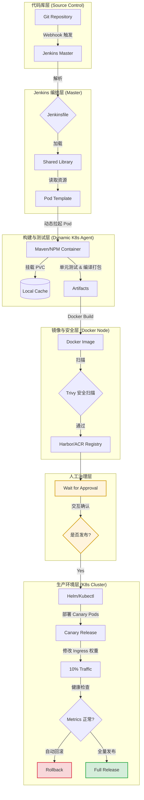

### 关于jenkins pipline 的ci cd 流水线的设计开发维护，给一份面试题


这份面试题不仅涵盖了基础概念，还深入到了**企业级实战**、**安全性**和**性能优化**。我将其分为四个维度，从基础到专家级，并附带了简要的考察要点。

------

## 🛠️ 第一部分：基础与声明式语法 (Fundamentals)

*考察候选人是否真的写过 Pipeline，而不是只在 Web 界面点点点。*

1. **Scripted Pipeline 与 Declarative Pipeline 有什么区别？为什么现在推荐后者？**
   - *要点：* 灵活性 vs. 结构化、容错性、语法校验、学习曲线。
2. **`agent none` 在什么场景下使用？**
   - *要点：* 阶段级（Stage-level）调度、多环境/多平台混合构建。
3. **如何处理 Pipeline 中的凭据（Credentials）？**
   - *要点：* `withCredentials` 包装器、Credential ID 的安全引用。
4. **`post` 部分有哪些常见的条件判断（Conditionals）？**
   - *要点：* `always`, `success`, `failure`, `unstable`, `changed`。

------

## 🚀 第二部分：高级实战与工程化 (Advanced Practice)

*考察候选人解决复杂流程和流水线复用的能力。*

1. **什么是 Shared Libraries？为什么要设计它？请描述其标准目录结构。**
   - *要点：* 代码复用、DRY原则、`vars/`, `src/`, `resources/` 目录的作用。
2. **如何在 Pipeline 中实现并行构建（Parallelism）？如何限制最大并行度？**
   - *要点：* `parallel` 关键字、FailFast 模式。
3. **如何实现一个“人工确认（Manual Approval）”环节而不占用 Executor 资源？**
   - *要点：* `input` 步骤的使用，以及将其放在分配 `agent` 之前的重要性。
4. **Pipeline 如何处理异常？如何确保无论成功失败都能清理工作空间？**
   - *要点：* `try-catch-finally`（脚本式）或 `post { always { cleanWs() } }`（声明式）。

------

## ⚙️ 第三部分：CI/CD 全生命周期集成 (Integrations)

*考察流水线与外部工具（Git, Docker, K8s）的配合。*

1. **如何实现“代码提交即触发”构建？描述 Webhook 的配置流程。**
   - *要点：* GitLab/GitHub Webhook、Generic Webhook Trigger、轮询扫描。
2. **描述一个典型的 Docker 化流水线流程。**
   - *要点：* `docker.build`, `docker.withRegistry`, 镜像版本标签（Tagging）策略。
3. **在 K8s 环境下使用 Jenkins，如何配置动态 Agent（Dynamic Provisioning）？**
   - *要点：* Kubernetes Plugin、Pod Template、容器化构建。
4. **如何实现灰度发布（Canary）或蓝绿发布（Blue-Green）在 Pipeline 中的逻辑？**
   - *要点：* 流量切换逻辑、健康检查、自动化回滚策略。

------

## 🛡️ 第四部分：维护、优化与排痛 (Maintenance & Optimization)

*考察候选人处理大规模流水线和 Jenkins 系统管理的能力。*

1. **Jenkins Master 磁盘空间满了，通常由哪些原因引起？如何通过 Pipeline 脚本规避？**
   - *要点：* 日志滚动策略、旧构建清理（Build Discarder）、Workspace 未清理。
2. **Pipeline 运行太慢，有哪些优化方向？**
   - *要点：* 增量构建、缓存（Maven/NPM local cache）、并行化、减少 Agent 与 Master 间的大文件传输。
3. **如何“平滑”地更新 Shared Library 代码而不影响线上正在运行的任务？**
   - *要点：* 版本控制（Version Specifier，如 `@master` 或指定 Tag/Commit ID）。
4. **Jenkinsfile 越来越大（超过 1000 行），你会如何重构它？**
   - *要点：* 逻辑下沉到 Shared Library、拆分子任务、使用脚本化方法。

------

### 💡 面试官小贴士（Tips）

- **看重逻辑思维：** 询问候选人如何设计**回滚（Rollback）**逻辑。好的 CD 必须考虑失败后的处理。
- **关注安全性：** 必问“如何在控制台日志中隐藏敏感变量”。
- **区分环境：** 询问他们如何在一套流水线里区分 `dev`, `test`, `prod` 环境（通常是环境变量或 Parameters）。

**需要我针对其中某个具体的技术点（比如 Shared Library 的代码实现）为你提供一份参考代码吗？**


1. Scripted Pipeline 与 Declarative Pipeline 有什么区别？为什么现在推荐后者？
• 要点： 灵活性 vs. 结构化、容错性、语法校验、学习曲线。
2. agent none 在什么场景下使用？
• 要点： 阶段级（Stage-level）调度、多环境/多平台混合构建。
3. 如何处理 Pipeline 中的凭据（Credentials）？
• 要点： withCredentials 包装器、Credential ID 的安全引用。
4. post 部分有哪些常见的条件判断（Conditionals）？
• 要点： always, success, failure, unstable, changed。 回答


针对这四个 Jenkins Pipeline 的核心基础问题，这里为你整理了一份标准答案及解析：

------

### 1. Scripted Pipeline 与 Declarative Pipeline 有什么区别？为什么推荐后者？

**区别对比：**

| 特性         | **Declarative Pipeline (声明式)**     | **Scripted Pipeline (脚本式)**     |
| ------------ | ------------------------------------- | ---------------------------------- |
| **语法风格** | 结构化、严谨（类似 JSON/YAML）        | 基于 Groovy 脚本，高度灵活         |
| **学习曲线** | 低，预定义了标准段落（steps, stages） | 高，需要具备一定的 Groovy 编程基础 |
| **校验逻辑** | 可以在执行前进行语法静态校验          | 只有运行到特定行时才会发现语法错误 |
| **容错性**   | 内置错误检查，更健壮                  | 容易写出复杂的逻辑导致难以维护     |

**为什么推荐声明式（Declarative）：**

- **标准化：** 声明式提供了清晰的蓝图结构，使得即使是非开发人员（如测试、运维）也能快速读懂流水线逻辑。
- **容错与校验：** 它能在流水线真正开始跑任务前检查是否有语法错误，节省了调试时间。
- **插件集成：** 大多数现代 Jenkins 插件都优先适配声明式语法。
- **可移植性：** 结构化的语法更易于与 Jenkins 蓝图（Blue Ocean）等可视化工具配合。

------

### 2. `agent none` 在什么场景下使用？

**核心概念：** 在 Pipeline 顶部定义 `agent none` 意味着**全局不分配执行节点**。

**使用场景：**

- **阶段级（Stage-level）调度：** 不同的 Stage 需要运行在完全不同的环境上。
  - *示例：* Stage 1 需要在 Windows 节点编译 .NET 程序的客户端，Stage 2 需要在 Linux 节点构建 Docker 镜像。
- **节省资源：** 如果流水线开始有一些步骤（如 `input` 人工确认）不需要占用 Executor 资源，使用 `agent none` 可以避免在等待确认时空占坑位。
- **混合构建：** 适用于复杂的多平台并行任务，可以在不同的 `parallel` 分支中定义各自独立的 `agent`。

------

### 3. 如何处理 Pipeline 中的凭据（Credentials）？

**处理原则：** 严禁将密码、Token 等明文写在 `Jenkinsfile` 中，必须通过 Jenkins 的凭据管理系统调用。

**核心方法：**

- **`withCredentials` 包装器：** 这是最常用的安全方式。

  Groovy

  ```
  withCredentials([usernamePassword(credentialsId: 'my-id', passwordVariable: 'P', usernameVariable: 'U')]) {
      sh "login.sh -u $U -p $P"
  }
  ```

- **`credentials` 指令（声明式）：** 直接在 `environment` 块中注入。

  Groovy

  ```
  environment {
      AWS_ACCESS = credentials('aws-secret-key')
  }
  ```

- **安全引用：** Jenkins 会自动对这些变量进行**日志脱敏（Masking）**，在控制台输出中会显示为 `****`。

------

### 4. `post` 部分有哪些常见的条件判断？

`post` 部分用于在 Pipeline 或 Stage 结束时根据运行结果执行清理或通知操作。

**常见条件判断：**

1. **`always`：** 无论结果如何（成功、失败、中止）都会执行。常用于清理临时文件、发送最终报告。
2. **`success`：** 仅在当前运行状态为“成功”时触发。通常用于自动触发部署或发送喜报。
3. **`failure`：** 仅在状态为“失败”时触发。常用于发送邮件/钉钉告警。
4. **`unstable`：** 测试用例失败或代码静态检查未通过（但构建没崩）时触发。
5. **`changed`：** 仅当本次运行状态与上一次不同时触发。这在监控系统恢复或连续失败后的告警中非常有用。

------

**下一步建议：** 如果你正在准备面试，我可以为你提供一个包含上述所有元素的 **“标准企业级声明式流水线模板”**，你可以直接在面试中用来展示你对结构化设计的理解。需要我发给你吗？


考察候选人解决复杂流程和流水线复用的能力。
1. 什么是 Shared Libraries？为什么要设计它？请描述其标准目录结构。
  • 要点： 代码复用、DRY原则、vars/, src/, resources/ 目录的作用。
2. 如何在 Pipeline 中实现并行构建（Parallelism）？如何限制最大并行度？
  • 要点： parallel 关键字、FailFast 模式。
3. 如何实现一个“人工确认（Manual Approval）”环节而不占用 Executor 资源？
  • 要点： input 步骤的使用，以及将其放在分配 agent 之前的重要性。
4. Pipeline 如何处理异常？如何确保无论成功失败都能清理工作空间？
  • 要点： try-catch-finally（脚本式）或 post { always { cleanWs() } }（声明式）。 回答


这部分问题深入到了 Jenkins 的**工程化能力**。一个优秀的 DevOps 工程师不仅要能让流水线跑通，还要能让它**可维护、可扩展且节省资源**。

以下是针对这四个问题的深度回答：

------

### 1. 什么是 Shared Libraries？为什么要设计它？请描述其标准目录结构。

**定义与设计初衷：** Shared Libraries（共享库）是 Jenkins 插件提供的机制，允许将通用的流水线代码逻辑从单独的 `Jenkinsfile` 中抽离出来，版本化托管在 Git 仓库中。

- **DRY原则 (Don't Repeat Yourself)：** 避免上百个项目重复编写相同的构建、测试、部署逻辑。
- **统一维护：** 修改一个库文件，所有引用该库的流水线都能同步更新。
- **降低门槛：** 资深工程师写好库，普通开发只需在 `Jenkinsfile` 里调用简单的函数。

**标准目录结构：**

- **`vars/`：** 存放全局变量和自定义步骤（脚本式插件）。每个 `.groovy` 文件就是一个可以直接在 Pipeline 中调用的命令（如 `buildApp.groovy`）。
- **`src/`：** 存放标准的 Groovy 类代码（面向对象）。适用于复杂的业务逻辑封装，通过 `import` 引用。
- **`resources/`：** 存放非 Groovy 资源文件。例如 SQL 脚本、JSON 配置模板、Dockerfiles 等，可以通过 `libraryResource` 步骤读取。

------

### 2. 如何在 Pipeline 中实现并行构建？如何限制最大并行度？

**实现方式：** 使用 `parallel` 关键字，将不同的任务放在一个阶段内同时运行。

Groovy

```
stage('Parallel Tests') {
    parallel {
        stage('Unit Test') { steps { sh 'make test-unit' } }
        stage('Integration Test') { steps { sh 'make test-int' } }
    }
}
```

**关键机制：**

- **FailFast 模式：** 默认情况下，并行分支中有一个失败，其他分支仍会继续。设置 `failFast true` 后，只要任何一个分支失败，Jenkins 会立即终止其他还在运行的分支。
- **限制最大并行度：** * **Pipeline 级别：** Jenkins 核心语法没有直接的“maxParallel”参数，通常通过**锁（Lockable Resources 插件）**来限制。
  - **项目级别：** 在任务配置中勾选“Execute concurrent builds if necessary”并配合插件限制。

------

### 3. 如何实现一个“人工确认”环节而不占用 Executor 资源？

**核心痛点：** 如果 `input` 步骤放在 `agent { label 'heavy-node' }` 之后，Jenkins 会先占用一个执行机位置，然后在那儿死等用户点击。这会导致资源浪费（资源阻塞）。

**正确实现逻辑：** 将 `input` 放在**分配 Agent 之前**。

Groovy

```
stage('Promote to Prod') {
    agent none // 此时不分配执行机
    steps {
        script {
            // 在不占用 Executor 的情况下等待确认
            input message: "是否确认发布到生产环境？", ok: "发布"
        }
    }
    // 确认后，在后续的子 Stage 或当前阶段重新声明 agent
}
```

- **要点：** 通过在 Stage 级别设置 `agent none` 或不指定全局 agent，可以确保 Jenkins 只在 Master 上运行轻量级的等待逻辑，不消耗真正的构建节点（Worker Node）。

------

### 4. Pipeline 如何处理异常？如何确保无论成功失败都能清理工作空间？

**异常处理：**

- **声明式 (Declarative)：** 主要是通过 `post` 块捕获。
- **脚本式 (Scripted)：** 使用标准的 Groovy `try-catch-finally`。

**清理工作空间（Workspace）：** 为了防止构建机磁盘被撑爆，清理工作空间是**必修课**。

- **声明式最佳实践（推荐）：** 使用 `cleanWs()` 步骤放在 `post { always { ... } }` 中。

  Groovy

  ```
  post {
      always {
          cleanWs() // 无论构建成功、失败、还是被手动停止，都会清理
      }
      failure {
          emailext body: "构建失败...", subject: "告警"
      }
  }
  ```

- **脚本式实践：**

  Groovy

  ```
  try {
      node { ...构建逻辑... }
  } catch (e) {
      currentBuild.result = "FAILURE"
      throw e
  } finally {
      node { cleanWs() } // 必须重新进入 node 块执行清理
  }
  ```

------

**面试追问预警：** 面试官可能会接着问：“如果 `cleanWs()` 失败了怎么办？”或者“在高并发环境下，Shared Libraries 里的变量冲突问题如何解决？”。

需要我针对 **Shared Library 的变量线程安全问题** 或者 **容器化构建中的空间清理** 深入讲解一下吗？


第三部分：CI/CD 全生命周期集成 (Integrations)
考察流水线与外部工具（Git, Docker, K8s）的配合。
1. 如何实现“代码提交即触发”构建？描述 Webhook 的配置流程。
  • 要点： GitLab/GitHub Webhook、Generic Webhook Trigger、轮询扫描。
2. 描述一个典型的 Docker 化流水线流程。
  • 要点： docker.build, docker.withRegistry, 镜像版本标签（Tagging）策略。
3. 在 K8s 环境下使用 Jenkins，如何配置动态 Agent（Dynamic Provisioning）？
  • 要点： Kubernetes Plugin、Pod Template、容器化构建。
4. 如何实现灰度发布（Canary）或蓝绿发布（Blue-Green）在 Pipeline 中的逻辑？
  • 要点： 流量切换逻辑、健康检查、自动化回滚策略。 回答


这部分问题考察的是候选人是否具备将 Jenkins 融入 **云原生生态（Cloud Native）** 的能力。一个合格的工程师需要打通从代码仓库到 K8s 集群的整条链路。

以下是针对这四个问题的深度回答：

------

### 1. 如何实现“代码提交即触发”构建？描述 Webhook 的配置流程。

**核心机制：** 主要通过 **Webhook（钩子）** 实现，即代码仓库（GitLab/GitHub）在监听到 Push 或 Merge Request 事件时，主动向 Jenkins 发送一个 HTTP Post 请求。

**配置流程：**

1. **Jenkins 端：**
   - 安装对应的插件（如 GitLab Plugin）。
   - 在任务配置中勾选 "Build when a change is pushed to GitLab"。
   - 生成一个 **Secret Token**，并记录下生成的 **Webhook URL**。
2. **Git 端（以 GitLab 为例）：**
   - 进入项目设置 -> Webhooks。
   - 填入 Jenkins 的 URL 和 Token。
   - 勾选触发事件（如 `Push events` 或 `Merge request events`）。
3. **替代方案：**
   - **Generic Webhook Trigger：** 灵活性最高，可以通过 JSONPath 解析请求体里的参数（如只触发特定分支或特定的 Commit Message）。
   - **轮询扫描 (Poll SCM)：** 备选方案。Jenkins 主动定期检查代码库，但实时性差且对 Git 服务器压力大。

------

### 2. 描述一个典型的 Docker 化流水线流程。

**核心流程（Build-Once, Run-Everywhere）：**

1. **环境准备：** 确保 Jenkins Node 已安装 Docker 引擎，且 `jenkins` 用户有执行权限。
2. **构建镜像（`docker.build`）：**
   - 使用 `Jenkinsfile` 中的 Docker DSL 进行构建。
3. **镜像标签策略（Tagging）：**
   - **不推荐**只使用 `latest`。
   - **推荐策略：** `v${BUILD_NUMBER}`（构建号）、`${GIT_COMMIT}`（哈希值前七位）或时间戳。
4. **推送到仓库（`docker.withRegistry`）：**
   - 使用凭据登录私有仓库（如 Harbor 或阿里云 ACR）。
5. **清理：** 删除本地生成的临时镜像，防止磁盘撑爆。

**示例代码段：**

Groovy

```
docker.withRegistry('https://harbor.com', 'credentials-id') {
    def customImage = docker.build("my-app:${env.BUILD_ID}")
    customImage.push()
}
```

------

### 3. 在 K8s 环境下使用 Jenkins，如何配置动态 Agent？

**核心思路：** 利用 **Kubernetes Plugin** 实现 **Dynamic Provisioning（按需拉起）**。Jenkins Master 不再管理固定的 Worker 节点，而是将 Agent 以 Pod 的形式运行在 K8s 集群中，任务结束即销毁。

**配置要点：**

1. **Cloud 配置：** 在 Jenkins 系统管理中添加 "Kubernetes" 云，配置 K8s API 地址和证书。

2. **Pod Template 定义：**

   - 定义 Pod 的镜像（必须包含 `jnlp-agent` 容器）。
   - 定义容器内的资源限制（CPU/Memory Request & Limit）。
   - 挂载持久化卷（如缓存 Maven 依赖的 PVC）。

3. **Pipeline 调用：**

   Groovy

   ```
   pipeline {
       agent {
           kubernetes {
               yaml """
               apiVersion: v1
               kind: Pod
               spec:
                   containers:
                   - name: maven
                     image: maven:3.8.1-jdk-11
                     command: ['cat']
                     tty: true
               """
           }
       }
       stages {
           stage('Build') {
               steps { container('maven') { sh 'mvn clean package' } }
           }
       }
   }
   ```

------

### 4. 如何实现灰度（Canary）或蓝绿（Blue-Green）发布逻辑？

**核心原则：** 核心不在于 Jenkins 自身，而在于 Jenkins 如何控制 **Ingress/Service** 或 **Service Mesh（如 Istio）**。

- **蓝绿发布 (Blue-Green)：**
  - **流程：** 部署一套全量新环境（Green），测试通过后，通过 Jenkins 调用脚本修改 Service 的 Label Selector，将流量一次性从旧环境（Blue）切到新环境。
  - **回滚：** 只需要将 Selector 改回旧版本，秒级回滚。
- **灰度/金丝雀发布 (Canary)：**
  - **流量切换：** Jenkins 调用 `kubectl` 或 Helm 部署少量新版本 Pod，并结合 Ingress 控制权重（如 10% 流量给新版）。
  - **健康检查：** 结合监控系统（如 Prometheus），如果错误率上升，则自动触发回滚。
- **自动化回滚策略：**
  - 在 Pipeline 的 `post { failure { ... } }` 块中加入回滚命令（如 `kubectl rollout undo`）。

------

**面试加分建议：** 如果面试官问及“如何保证安全性”，你可以主动提到 **Docker Content Trust** 或使用 **Trivy/Snyk** 在 Pipeline 中进行镜像扫描。

**需要我为你提供一个完整的“从 Git 提交到 K8s 灰度发布”的 Jenkinsfile 架构图吗？** 这样你在面试时描述起来会更有画面感。


第四部分：维护、优化与排痛 (Maintenance & Optimization)
考察候选人处理大规模流水线和 Jenkins 系统管理的能力。
1. Jenkins Master 磁盘空间满了，通常由哪些原因引起？如何通过 Pipeline 脚本规避？
  • 要点： 日志滚动策略、旧构建清理（Build Discarder）、Workspace 未清理。
2. Pipeline 运行太慢，有哪些优化方向？
  • 要点： 增量构建、缓存（Maven/NPM local cache）、并行化、减少 Agent 与 Master 间的大文件传输。
3. 如何“平滑”地更新 Shared Library 代码而不影响线上正在运行的任务？
  • 要点： 版本控制（Version Specifier，如 @master 或指定 Tag/Commit ID）。
4. Jenkinsfile 越来越大（超过 1000 行），你会如何重构它？
  • 要点： 逻辑下沉到 Shared Library、拆分子任务、使用脚本化方法。 回答

这部分问题考察的是候选人作为 **Jenkins 管理员或资深架构师** 的实战经验。在大规模企业级应用中，稳定性和效率往往比“跑通”更重要。

以下是针对第四部分“维护、优化与排痛”的深度回答：

------

### 1. Jenkins Master 磁盘空间满了，通常由哪些原因引起？如何规避？

**主要原因：**

- **构建历史过多：** 默认保留所有历史记录，导致大量的日志文件（`build.log`）和 Artifacts（归档产物）堆积。
- **工作空间（Workspace）未清理：** Agent 上的文件会拉取到本地，如果任务结束不清理，磁盘很快会被撑爆。
- **插件日志与临时文件：** 某些插件产生的大量调试日志或 `/tmp` 下的缓存。

**规避方法（Pipeline 脚本层面）：**

- **配置 `buildDiscarder`（必选）：** 在 `options` 中限制保留的构建个数或天数。

  Groovy

  ```
  options {
      buildDiscarder(logRotator(numToKeepStr: '10', artifactNumToKeepStr: '5'))
  }
  ```

- **强制清理 Workspace：** 使用 `cleanWs()` 确保无论成功失败都清理目录。

- **产物上传：** 尽量不要将巨大的包 `archiveArtifacts` 到 Master，而是推送到 Nexus/Artifactory。

------

### 2. Pipeline 运行太慢，有哪些优化方向？

**优化方向：**

- **缓存机制（核心）：** * **持久化缓存：** 将 `~/.m2` (Maven) 或 `node_modules` (NPM) 挂载到宿主机卷（PVC），避免每次从公网下载几百 MB 的依赖。
  - **Docker 缓存：** 确保 Dockerfile 编写规范（利用 Layer Cache）。
- **并行化（Parallel）：** 将互不依赖的步骤（如单元测试、代码扫描、UI测试）并行运行，缩短整体耗时。
- **增量构建：** * 使用 Git 的 `shallow clone`（`depth: 1`）减少代码拉取时间。
  - 如果是单体大仓库，仅针对变动目录进行编译。
- **减少大文件传输：** 避免在 Master 和 Agent 之间频繁传输压缩包，尽量在 Agent 本地处理并直接上传仓库。

------

### 3. 如何“平滑”更新 Shared Library 而不影响运行中的任务？

**核心机制：版本化管理（Versioning）** Jenkins Shared Library 支持 Git 分支、Tag 或 Commit ID 的加载。

**实施方法：**

- **加载指定版本：** 在 `Jenkinsfile` 引用库时，不要只写名字，要指定版本。

  Groovy

  ```
  @Library('my-shared-library@v1.2.3') _  // 生产环境引用固定 Tag
  ```

- **开发流控制：** * `master` 分支：仅存放经过测试的稳定代码。

  - `develop` 分支：用于新功能测试。
  - **灰度测试：** 针对特定的测试任务引用 `@feature-x` 分支，确保稳定后才合并回 `master` 并打 Tag。

- **动态加载：** 利用 `library` 步骤在运行过程中按需加载特定版本。

------

### 4. Jenkinsfile 超过 1000 行，你会如何重构它？

**重构策略：**

- **逻辑下沉到 Shared Library：**
  - 将重复的 `sh` 命令或复杂的 Groovy 逻辑封装成 `vars/` 下的函数。例如，把 50 行的部署逻辑简化为 `deployToK8s(env: 'prod')`。
- **拆分子任务（Upstream/Downstream）：**
  - 如果流水线太长，可以拆分为“构建流水线”和“部署流水线”，通过 `build job: 'deploy-job'` 触发。
- **使用声明式与脚本式混合：**
  - 在声明式的主框架下，使用 `script { ... }` 块调用 Shared Library 中的类库（`src/` 下的对象），将复杂算法移出 Pipeline。
- **模板化：**
  - 定义一个“标准流水线”函数，各项目只需传入几个参数（如项目名、端口），实现“一行代码定义流水线”。

------

**面试官总结：** 这四个问题考察的是候选人是否具备 **“可持续交付”** 的意识。一个好的流水线应该是：**历史可查但不过期、速度飞快且不占资源、更新平滑且结构优雅**。

**需要我针对其中某个点（例如如何配置持久化 Maven 缓存）提供一个具体的 K8s 挂载配置示例吗？**


### “如果 cleanWs() 失败了怎么办？”或者“在高并发环境下，Shared Libraries 里的变量冲突问题如何解决？”。


这两个问题直接戳中了 Jenkins 流水线开发的“深水区”。能问出这类问题，说明面试官在考察你对 **Jenkins 底层运行机制（Groovy 内存模型）** 和 **分布式节点容错** 的理解。

以下是针对这两个难题的深度解析：

------

### 1. 如果 `cleanWs()` 失败了怎么办？

在企业级实战中，`cleanWs()` 失败通常是因为 **文件被进程占用（Locked）** 或 **权限问题**。

**应对策略：**

- **物理层强制清理：**

  如果 `cleanWs()`（来自 Workspace Cleanup 插件）失效，可以回退到系统级命令，并配合 `catchError` 防止流水线直接崩溃。

  Groovy

  ```
  post {
      always {
          script {
              try {
                  cleanWs()
              } catch (Exception e) {
                  // 如果插件清理失败，执行系统级强制删除
                  sh "rm -rf ${WORKSPACE}/* || true" 
                  echo "Standard cleanWs failed, executed forced shell cleanup."
              }
          }
      }
  }
  ```

- **使用 Docker 容器构建：**

  最佳实践是**不在宿主机直接构建**。所有构建都在容器内进行，任务结束后容器销毁，Workspace 挂载点自然清理。

- **前置清理逻辑：**

  不要只依赖后置清理。在流水线的第一个 Stage（如 `Checkout`）之前执行 `deleteDir()`，确保本次构建始于一个干净的目录。

- **监控与告警：**

  如果清理频繁失败，说明 Node 上可能有僵尸进程。应通过 Prometheus 监控磁盘水位，及时介入处理。

------

### 2. 高并发环境下，Shared Libraries 的变量冲突问题如何解决？

这是一个非常经典的 **Groovy 线程安全** 问题。

**问题根源：**

在 Shared Library 的 `vars/` 目录下定义全局变量时，如果在脚本中使用了 **类静态变量（Static fields）** 或者 **非本地变量**，多个并发运行的 Pipeline 可能会共享同一个内存空间，导致数据互相覆盖。

**解决方案：**

#### A. 避免使用 `static` 关键字

在 Shared Library 的 `src/` 类库中，尽量使用实例变量。每次 Pipeline 调用时，通过 `new` 关键字实例化对象，确保每个 Job 拥有独立的内存对象。

#### B. 利用 `steps` 传参而非全局状态

在 `vars/` 脚本中，不要在方法外部定义变量。所有的状态应该通过参数传递，或者存储在 `env` 环境变量中（`env` 是 Job 级别的，天然隔离）。

#### C. 使用 `ThreadLocal` (高级玩法)

如果你必须在 Shared Library 中维护一些状态，可以使用 Java 的 `ThreadLocal` 来确保变量绑定在特定的执行线程上。

#### D. 遵循“无状态设计”原则

重构 Shared Library，确保每个自定义步骤（Custom Step）都是**幂等且无状态**的。

- **错误写法：** 在全局定义一个 `config` Map，所有函数都去读写它。
- **正确写法：** 每个函数接收自己需要的参数，处理完后返回结果。

------

### 💡 面试总结话术

> “对于 **`cleanWs()` 失败**，我的原则是‘前置清理+后置补偿’，并结合容器化构建彻底规避磁盘残留问题。”
>
> “对于 **Shared Library 变量冲突**，我坚持‘无状态化设计’。在 `vars` 脚本中严格通过局部变量处理逻辑，避免使用静态全局变量。通过 `new` 实例化类对象来利用 Groovy 的沙箱隔离机制，确保并发任务的线程安全。”

**如果你在准备面试，我还可以为你提供一个“如何设计一套百万级代码量的 Jenkins 企业级架构图”，涵盖了负载均衡、多 Slave 调度和高可用 Master 的设计。需要看看吗？**


### 提供一个包含上述所有元素的 “标准企业级声明式流水线模板”，你可以直接在面试中用来展示你对结构化设计的理解


这份流水线模板不仅涵盖了你之前问过的所有核心知识点（Shared Library, Agent 调度, Docker, K8s, 异常处理, 磁盘清理），还体现了**模块化**和**防御性编程**的设计思想。

你可以直接向面试官展示这个结构，解释你如何通过声明式语法实现一个高可靠、可复用的 CI/CD 流程。

------

### 企业级声明式流水线模板 (Jenkinsfile)

Groovy

```
// 1. 引用共享库，实现逻辑复用
@Library('my-shared-library@v1.2.0') _

pipeline {
    // 2. 初始 agent none，配合 input 节省 Executor 资源
    agent none

    // 3. 配置全局选项：日志轮转（磁盘优化）、超时监控
    options {
        buildDiscarder(logRotator(numToKeepStr: '10', artifactNumToKeepStr: '5'))
        timeout(time: 1, unit: 'HOURS')
        timestamps()
        disableConcurrentBuilds() // 防止高并发下的资源竞争
    }

    // 4. 定义全局环境变量
    environment {
        DOCKER_REGISTRY = "harbor.example.com"
        APP_NAME        = "user-service"
        IMAGE_TAG       = "v${env.BUILD_ID}-${sh(script: 'git rev-parse --short HEAD', returnStdout: true).trim()}"
    }

    stages {
        // 5. 动态 Kubernetes Agent：按需在 K8s 中拉起 Pod
        stage('Build & Test') {
            agent {
                kubernetes {
                    yaml libraryResource('pod-templates/maven-docker.yaml') // 从 Shared Library 读取 Pod 定义
                }
            }
            steps {
                container('maven') {
                    // 调用 Shared Library 中的封装函数
                    script {
                        standardBuild.mavenPackage() 
                    }
                }
            }
        }

        stage('Docker Push') {
            agent { label 'docker-node' } // 调度到特定标签的物理/虚拟机节点
            steps {
                // 6. 凭据安全引用：使用 withCredentials 或 credentials 指令
                withCredentials([usernamePassword(credentialsId: 'harbor-auth', passwordVariable: 'PWD', usernameVariable: 'USER')]) {
                    sh """
                        docker login ${DOCKER_REGISTRY} -u ${USER} -p ${PWD}
                        docker build -t ${DOCKER_REGISTRY}/${APP_NAME}:${IMAGE_TAG} .
                        docker push ${DOCKER_REGISTRY}/${APP_NAME}:${IMAGE_TAG}
                    """
                }
            }
        }

        // 7. 人工确认环节：不占用任何 Agent 资源，仅在 Master 运行
        stage('Approve Deployment') {
            steps {
                input message: "确认发布 ${IMAGE_TAG} 到生产环境吗？", ok: "同意发布"
            }
        }

        stage('Deploy to K8s') {
            agent { label 'k8s-admin' }
            steps {
                // 8. 灰度发布逻辑：调用封装好的 K8s 部署函数
                script {
                    k8sDeploy.canary(
                        appName: env.APP_NAME,
                        image: "${env.DOCKER_REGISTRY}/${env.APP_NAME}:${IMAGE_TAG}",
                        weight: 10
                    )
                }
            }
        }
    }

    // 9. 完善的后置处理与资源清理
    post {
        always {
            // 解决磁盘占用的核心：强制清理工作空间
            cleanWs()
            echo "Pipeline finished, workspace cleaned."
        }
        success {
            // 发送通知，实现闭环
            notification.sendDingTalk("构建成功：${env.APP_NAME}:${env.IMAGE_TAG}")
        }
        failure {
            // 异常处理：自动回滚或发送告警
            notification.sendEmail("构建失败告警！")
            script {
                if (env.STAGE_NAME == 'Deploy to K8s') {
                    k8sDeploy.rollback(env.APP_NAME)
                }
            }
        }
    }
}
```

------

### 💡 核心亮点解析（面试话术）

1. **分层架构：** * 我使用了 `@Library` 将复杂的 Shell 脚本和 Groovy 逻辑下沉到 Shared Library。`Jenkinsfile` 只保留流程控制，这不仅整洁（不到 100 行），更实现了跨项目的 **DRY 原则**。
2. **资源效率（Resource Efficiency）：** * 通过 `agent none` 配合 `input` 步骤，我确保了在等待人工审核期间不会白白占用昂贵的构建节点 Executor 资源。
3. **动态弹性（Dynamic Provisioning）：** * `Build & Test` 阶段采用了 **Kubernetes Plugin**。通过 Pod Template 动态拉起 Agent，任务结束自动销毁，彻底解决了长期运行导致的磁盘污染问题。
4. **防御性编程（Defensive Programming）：** * `options` 中的 `buildDiscarder` 自动维护 Master 磁盘；`post` 中的 `cleanWs` 保证了 Slave 磁盘的整洁；`timeout` 避免了流水线死锁导致队列堆积。
5. **安全生产（Security & Reliability）：** * 采用 `withCredentials` 脱敏处理；镜像标签（Tag）使用 **构建号+Git哈希**，确保了每一个产物的唯一性和可追溯性。

------

**下一步建议：**

如果你在面试中展示了这份代码，面试官很有可能会问：“**既然用了 K8s 动态 Agent，如何解决 Maven 依赖或 npm_modules 每次重复下载慢的问题？**”

这是考察你对 **K8s PersistentVolume (PV)** 挂载的理解。你想让我继续补充这部分的配置代码吗？


### 提供一个完整的“从 Git 提交到 K8s 灰度发布”的 Jenkinsfile 架构图 用mermaid画


这是一个基于 **Jenkins 声明式流水线**、**Shared Library** 以及 **云原生 (K8s)** 环境的完整 CI/CD 架构图。

我为你设计了一个 Mermaid 流程图，它直观地展示了代码从 Git 提交到最终 K8s 灰度发布所经历的每一个逻辑环节。

代码段



------

### 🏛️ 架构核心逻辑解析

针对你在面试中可能需要进行的讲解，我把这个图拆解为四个关键“价值点”：

#### 1. 动态资源伸缩 (Dynamic Provisioning)

- **实现：** 整个构建过程不在 Master 运行，而是在 **K8s Agent** 容器中。
- **价值：** 解决了传统 Jenkins 节点环境配置不统一、磁盘清理难的问题。利用 `Local Cache`（通过 K8s 的 PVC 挂载）解决了 Maven/NPM 重复下载依赖的痛点。

#### 2. 安全与合规性 (Security Gate)

- **实现：** 在推送到 Registry 之前，加入了 **Trivy 安全扫描**。
- **价值：** 保证了进入镜像仓库的每一个版本都是经过漏洞检查的，实现“安全左移（DevSecOps）”。

#### 3. 资源节约与人工治理 (Governance)

- **实现：** 将 `L (Wait for Approval)` 放在镜像构建后。
- **价值：** 使用 `input` 指令且在此时不分配 Agent 节点，只占用 Master 的极少量线程。这是面试中区分“新手”和“资深架构师”的关键细节。

#### 4. 灰度发布策略 (Canary Strategy)

- **实现：** 利用 **Ingress Controller (Nginx/Istio)** 调整权重。
- **价值：** 相比直接替换（Recreate），灰度发布能通过 Prometheus 的反馈（Q 点）决定是继续扩大流量还是执行 `kubectl rollout undo` 自动回滚。

------

**面试话术示例：**

> “我的流水线架构不仅关注‘如何自动化’，更关注‘如何安全且节省地自动化’。例如，我通过共享库封装了 Pod 模板，通过 PVC 解决了构建加速问题；而在发布环节，我通过 Jenkins 与 K8s API 的深度集成，实现了基于 Metrics 反馈的自动化回滚逻辑。”

**你觉得这个架构里，关于“监控反馈驱动流水线回滚”的部分需要我补充相关的 Groovy 伪代码吗？** 这是目前很多大厂（如字节、阿里）非常看重的**闭环自动化**能力。